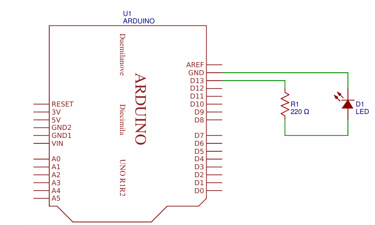

# Ex2 

Create an electronic circuit to make a led blink. 

Using : 

- Blue LED
- Resistor 220 ohm (you can use 220 to 470 ohm) 

## Schematic : 

## Arduino Code : 

- You can change the digital pin (use : 12, 11, 10...)
- You can change the code in the loop, if you want to change the delay, etc. 

[Code Arduino](./led-blink.ino)
