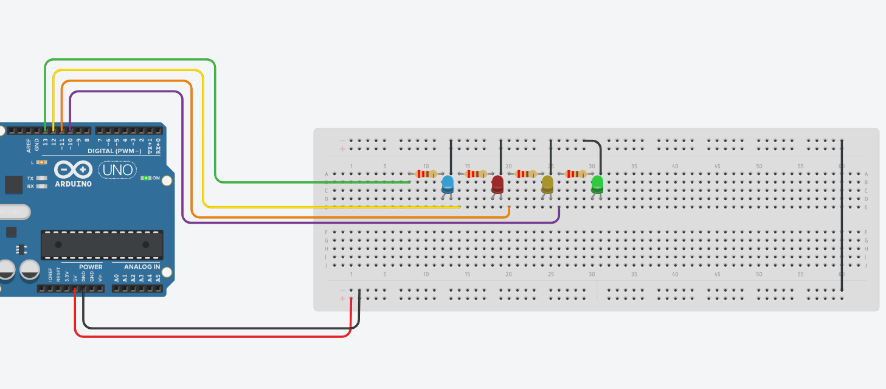

# Ex4 

Create a 4 LED chaser

Using : 

- 4 LEDs (blue, red, yellow, green)
- 4 Resistors 220 ohm (you can use 220 to 470 ohm) 

## Schematic : 

## Arduino Code : 
 
- You can try to modify the code in the loop to test other ideas (add other leds, modify the delay, etc). 

[Arduino Code](./four-leds-chaser.ino)